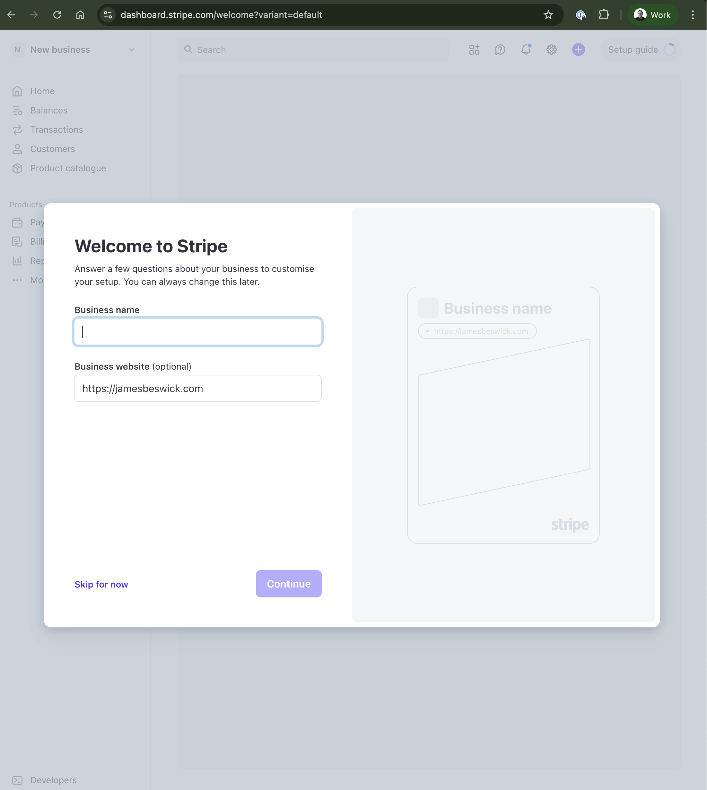
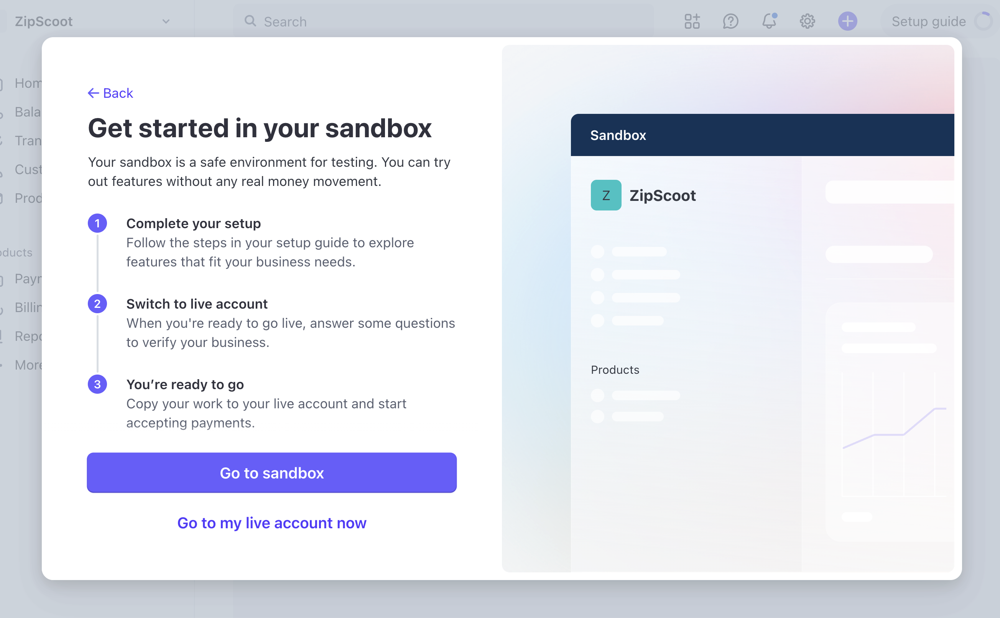
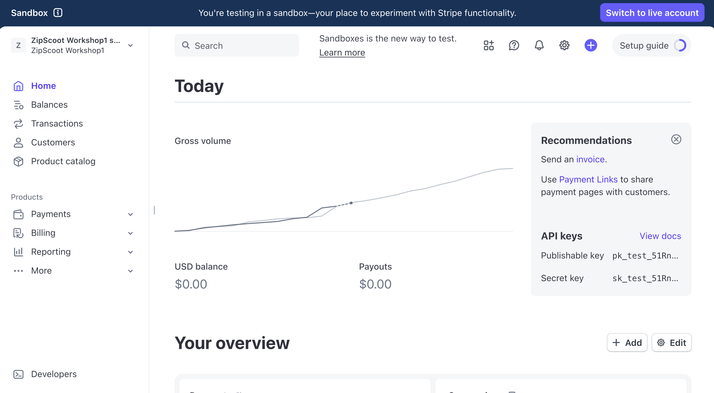
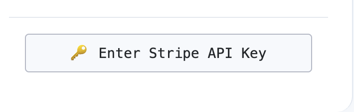
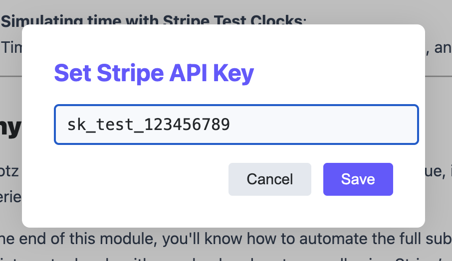

# Welcome to the Agentic Commerce Workshop

In this hands-on workshop, you'll customize an AI Agent to become an expert shopping assistant. You'll build a complete agentic commerce solution with:

- **Agent Service** - Orchestrates the checkout flow and creates Shared Payment Tokens
- **Merchant Service** - Implements ACP endpoints and processes payments using SPT
- **Integration** - Connects everything with a pre-built frontend and AI service

- Estimated time: 3-4 hours
- Skill level: Intermediate developers with JavaScript/Node.js knowledge

## Workshop Outcome

By the end of this workshop, you'll have:

- ✅ A working Merchant Service with ACP checkout endpoints
- ✅ A working Agent Service that creates SPT and orchestrates purchases
- ✅ Understanding of Shared Payment Tokens for secure cross-account payments
- ✅ A fully functional AI shopping assistant demo

## Who This Is For

This workshop is designed for developers who want to integrate AI agents with Stripe's payment infrastructure.

Perfect if you're:

- Building AI-powered shopping experiences
- Working on conversational commerce applications
- Integrating payment systems with AI agents
- Curious about the future of AI-driven commerce

You should know:

- JavaScript/Node.js fundamentals
- Express.js basics (helpful)
- How to use a terminal
- Basic API concepts (REST, JSON)

## Architecture Overview

```
┌──────────────┐     ┌──────────────────────┐     ┌─────────────────┐
│   Frontend   │────►│   Agent Service      │────►│ Merchant Service│
│   (Next.js)  │◄────│   (Express.js)       │◄────│ (ACP endpoints) │
└──────────────┘     └──────────┬───────────┘     └────────┬────────┘
                                │                          │
                    ┌─────────┴─────────┐                │
                    │                   │                │
             ┌──────▼──────┐    ┌───────▼───────┐ ┌──────▼───────┐
             │ AI Service  │    │ Agent Stripe  │ │Merchant Stripe│
             │ (AWS Lambda)│    │ (Cards, SPT)  │ │  (Payments)   │
             └─────────────┘    └───────────────┘ └──────────────┘
```

> **Note**: Two Stripe Accounts: The Agent and Merchant each have their own Stripe account. User payment methods are stored on the Agent's account. When a purchase completes, the Agent creates an SPT (Shared Payment Token) that the Merchant uses to charge the card via their own Stripe account.

## What You'll Build vs. What's Provided

| Component        | You Build?   | Description                      |
|------------------|--------------|----------------------------------|
| Frontend         | ❌ Provided   | Next.js UI for chat & checkout   |
| AI Service       | ❌ Provided   | AWS Lambda with OpenAI for NLU   |
| Agent Service    | ✅ You build  | Express.js - orchestration & SPT |
| Merchant Service | ✅ You build  | Express.js - ACP endpoints       |

## Service Responsibilities

### Frontend (Provided)
- Chat interface for user conversations
- Payment method collection via Stripe Elements
- Checkout status display
- ACP Inspector for debugging

### AI Service (Provided)
- Natural language understanding via an OpenAI model
- Intent detection (create checkout, update address, complete order)
- Product recommendations
- Conversation management

### Agent Service (You Build)
- Chat routing: Forwards messages to AI Service
- Checkout orchestration: Calls Merchant's ACP endpoints
- Payment management: Saves cards, creates SPT
- SPT creation: Issues Shared Payment Tokens for secure payment

### Merchant Service (You Build)
- Products API: Catalog for AI discovery
- ACP Checkouts: Create, update, complete, cancel
- Payment processing: Uses SPT to charge cards via Stripe

## The Data Flow

Here's what happens when a user completes a purchase:

```
User: "I want to buy the Blizzard Rustler 10 skis"
↓
Frontend → Agent Service → AI Service (Lambda)
↓
AI: "User wants SKI-001, create checkout"
↓
Agent → Merchant: POST /checkouts
↓
User: "Ship to 123 Main St, San Francisco"
↓
Agent → Merchant: PUT /checkouts/:id
↓
User: "Yes, complete my order"
↓
Agent: Create SPT from saved payment method
↓
Agent → Merchant: POST /checkouts/:id/complete (with SPT)
↓
Merchant: Creates PaymentIntent with SPT
↓
Stripe: Clones payment method, charges card
↓
Order complete! 🎉
```

## Project Structure

```
acp-demo/
├── frontend/           # Next.js UI (provided)
├── ai-service/         # AWS Lambda AI brain (provided)
├── agent-service/      # Agent backend (YOU BUILD)
│   ├── routes/
│   │   ├── chat.js     # AI communication
│   │   ├── checkout.js # ACP checkout calls
│   │   └── payment.js  # SPT creation
│   └── server.js
└── merchant-service/   # Merchant backend (YOU BUILD)
    ├── routes/
    │   ├── products.js # Product catalog
    │   └── checkouts.js # ACP endpoints
    └── server.js
```

- ✅ Architecture understood — You've reviewed the ACP demo architecture and understand the components you'll build

## Prerequisites

Before we begin, make sure you have the following set up on your machine.

### Required Tools and Software

**Microsoft Visual Studio Code** (or similar IDE):
- Download: https://code.visualstudio.com/

**Node.js** (version 20 or higher):
- Download: https://nodejs.org/
- Choose the LTS (Long Term Support) version
- To verify installation, run `node --version` in your terminal

**curl** command line tool:
- Windows: Usually pre-installed on Windows 10/11. If not available, download from https://curl.se/download.html
- Mac: Pre-installed on macOS
- To verify installation, run `curl --version` in your terminal

**Modern browser** (latest version recommended):
- Google Chrome: https://www.google.com/chrome/
- Mozilla Firefox: https://www.mozilla.org/firefox/
- Safari: Pre-installed on Mac

## Creating a Stripe Account

Before you start, you'll need a Stripe account. We recommend creating a new account for this workshop to avoid interfering with the configuration of any existing accounts you may have. Stripe accounts are free to create and take only a couple of minutes to set up.

### Setting Up a Stripe Account

1. **Visit the Stripe website**: Go to https://dashboard.stripe.com/register
2. **Get started**: Enter your email address, full name, a password, select a country and choose **Create account**. Confirm if asked.
3. **Verify your email**: Check your inbox for a verification email from Stripe and click the verification link.
4. **About your business**: Enter the Business name `acp-merchant`

   

5. Skip any other prompts until you can choose **Go to sandbox**

   

> **Note**: If this is your first time creating a Stripe account you will have an additional CTA to complete your profile, choose "Got it" and close the setup guide.

You will now land on the Stripe dashboard:



### Setting Up Your Stripe API Key

1. Copy your Secret API key from your [developer dashboard](https://dashboard.stripe.com/test/apikeys)

   

2. Click the **Enter Stripe API Key** button in the workshop navigation menu
3. Paste your Stripe secret key and choose **Save**

   

This will add the Stripe secret key to the heading of all curl requests in the workshop.

Open a new terminal in VS Code (**Terminal → New Terminal**) and test your API key:

```bash
export STRIPE_SECRET_KEY=sk_...
curl https://api.stripe.com/v1/account \
  -u "$STRIPE_SECRET_KEY:"
```

- ✅ Stripe account created — You have successfully created a new Stripe account and can see the Sandbox dashboard

## Get Your Account Ungated for SPT

To use the Shared Payment Token (SPT) feature later in the workshop, we need to enable it on your account. Follow these steps:

1. In your Stripe Dashboard, click the **Verify your business** button (or **Complete your profile**) to access your production account settings
2. Copy the full URL from your browser's address bar — it should look like:
   `https://dashboard.stripe.com/acct_xxx/account/onboarding/link-accounts`
3. Submit Your Account URL using the button provided in the workshop

> **Note**: A workshop helper will ungate your account shortly. You can continue with the next steps while you wait — you'll need SPT access starting in Module 3.

## Environment Setup

Now let's set up your local development environment. The project runs three services that work together — a setup script will configure and start them all for you.

### Clone the Workshop Repository

```bash
git clone https://github.com/benjasl-stripe/acp-workshop-starter-kit.git
cd acp-workshop-starter-kit
```

- ✅ Repository cloned — You've cloned the starter kit and are in the project directory

### Project Structure

```
acp-workshop-starter/
├── frontend/           # Next.js frontend application
├── agent-service/      # Agent orchestration service
└── merchant-service/   # Merchant backend with ACP endpoints
```

### Configure Environment Variables

Each service requires environment variables to run. A setup script handles everything — it will prompt you for the required values, install dependencies, and start all services.

Run the setup script:

```bash
./dev.sh --setup
```

You'll see prompts like:

```
📋 Setting up Agent Service environment...

STRIPE_SECRET_KEY
Current: Replace with your Stripe secret key
Enter value (or press Enter to skip):
```

Enter your values when prompted:

| Variable | Value |
|---|---|
| `LAMBDA_ENDPOINT` | `https://bnkl1g96p3.execute-api.us-west-2.amazonaws.com/Prod` |
| `STRIPE_PROXY_URL` | `https://wcwr15sy0k.execute-api.us-west-2.amazonaws.com/Prod` |
| `WORKSHOP_SECRET` | `sessions` |
| `STRIPE_SECRET_KEY` | Your Secret Key from your Stripe merchant account |

> **Note**: Press Enter to skip a value if you want to configure it manually later.

- ✅ Environment configured — You've entered the required environment variables

### Services Starting

After configuring environment variables, the script will automatically install dependencies and start all three services:

```
🚀 Starting all services...

═══════════════════════════════════════════════════
🚀 ACP Production Demo - All Services Running
═══════════════════════════════════════════════════

📱 Frontend         http://localhost:3000
🤖 Agent Service    http://localhost:3001
🏪 Merchant Service http://localhost:4000

═══════════════════════════════════════════════════
Press Ctrl+C to stop all services
Run with --setup to reconfigure .env files
═══════════════════════════════════════════════════
```

Keep this terminal running throughout the workshop.

| Service          | Port | Description                         |
|------------------|------|-------------------------------------|
| Frontend         | 3000 | AI chat interface                   |
| Agent Service    | 3001 | Agent orchestration                 |
| Merchant Service | 4000 | Merchant backend with ACP endpoints |

- ✅ Services running — All three services are running and you see the startup banner with URLs

### Verify Your Setup

1. Open http://localhost:3000 in your browser
2. Type a message like `"Hello"` or `"What can you help me with?"` in the chat
3. If everything is connected, you'll get a response from the AI

> **Note**: At this point, you'll see "No products configured yet" because we haven't connected a product catalog. That's expected — you'll configure products in Module 2!

- ✅ Chat working — You opened localhost:3000, sent a message, and received a response from the AI

## You're Ready!

Your environment is now set up with all three services running. In the next module, we'll dive into the foundation concepts of agentic commerce.
