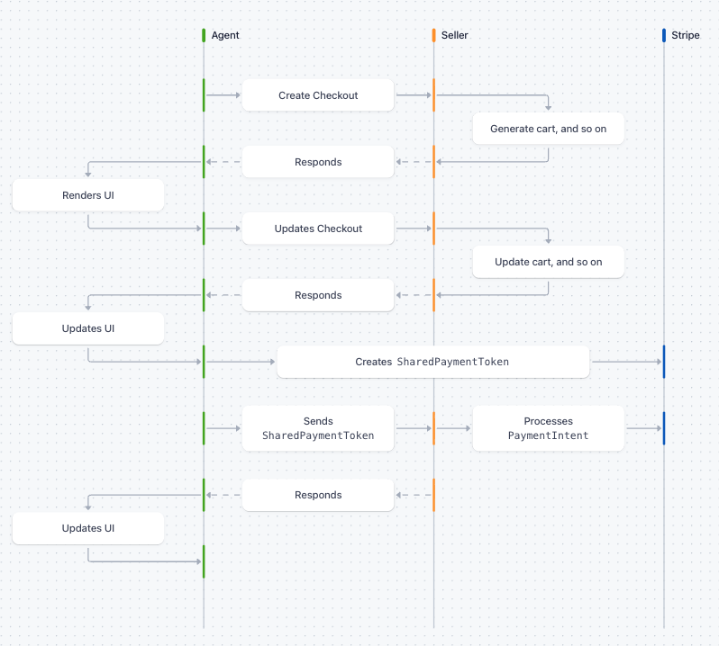
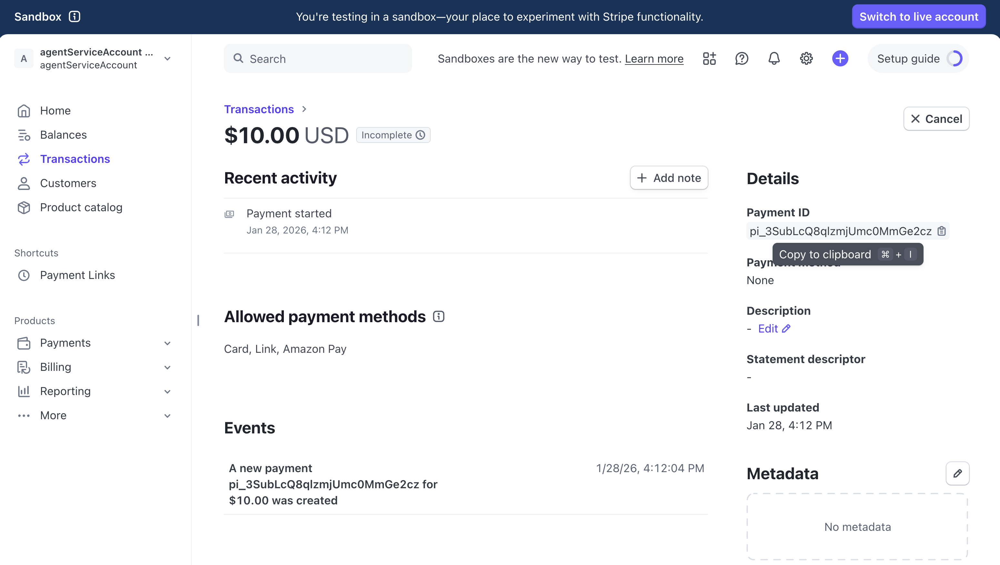

# Module 1: Foundation Concepts and Terminology

In this module, you'll learn the foundational concepts behind agentic commerce, including the Agentic Commerce Protocol (ACP) and Secure Payment Tokens (SPT).

You'll learn:

- What agentic commerce is and why it matters
- How the Agentic Commerce Protocol (ACP) works
- What Secure Payment Tokens (SPT) are and how they protect transactions
- The architecture of AI agent payment systems

> **Note**: This module will take approximately 30 minutes to complete.

## Why This Matters

As AI agents become more capable, users increasingly want them to take actions on their behalf—including making purchases. But this creates significant challenges:

- **Security**: How do you safely share payment credentials with an AI?
- **Trust**: How does a merchant know the AI is authorized to buy?
- **Compliance**: How do you maintain PCI compliance with AI in the loop?

The ACP and SPT standards solve these problems, creating a secure bridge between AI agents and payment systems.

> **Note**: PCI Compliance: The payment card industry data security standard (PCI DSS) refers to a combination of requirements that make sure all companies that store, process, or transmit credit card information provide an environment for their customers' data that is safe and secure.

## Module Objectives

By the end of this module, you'll be able to:

- Explain the key concepts of agentic commerce
- Describe how ACP enables secure AI-to-merchant communication
- Understand the role of SPT in protecting payment credentials
- Design AI agent architectures for commerce applications

## Agentic Commerce Overview

### What is Agentic Commerce?

Agentic commerce is a new paradigm where AI agents act on behalf of users to discover, evaluate, and purchase products and services. Instead of users navigating websites and checkout flows, they simply express their intent, and the AI handles the rest.

Examples of agentic commerce:

- **Shopping Assistant**: "Find me a birthday gift for my mom under $50 and order it"
- **Travel Agent**: "Book me a flight to Tokyo next month, cheapest option"
- **Subscription Manager**: "Upgrade my streaming plan to the family tier"
- **Procurement Bot**: "Reorder our office supplies when inventory is low"
- **Personal Shopper**: "Buy groceries for this week's meal plan"

### The Agentic Commerce Ecosystem

The agentic commerce ecosystem consists of three main participants:

1. **AI Agents** — Software systems (like ChatGPT, Claude, or custom agents) that:
   - Understand user intent through natural language
   - Discover and evaluate products
   - Initiate and complete purchases
   - Handle post-purchase support

2. **Merchants** — Businesses that:
   - Expose product catalogs for AI discovery
   - Accept payments from AI agents
   - Fulfill orders initiated by agents
   - Provide support and returns handling

3. **Payment Processors** — Infrastructure that:
   - Securely handles payment credentials
   - Processes transactions
   - Manages risk and fraud detection
   - Ensures compliance (PCI DSS, etc.)

### The Challenge

Traditional e-commerce assumes a human is directly interacting with the checkout flow. This creates problems for AI agents:

| Traditional Commerce | Agentic Commerce Challenge |
| --- | --- |
| User enters card details | AI can't "type" card numbers |
| User clicks "confirm" | AI needs programmatic confirmation |
| 3D Secure pop-ups | AI can't complete browser challenges |
| Session cookies | AI doesn't have browser context |

The solution? A new protocol designed specifically for AI-to-merchant communication: ACP.

> **Note**: Without a standardized protocol like ACP, every connection requires a custom integration.

### The Problem: Integration Chaos

Imagine you have M different AI personal assistants (like Gemini, ChatGPT, or specialized shopping bots) and N different retailers (like Amazon, a local boutique, or a grocery chain).

- **The Manual Way**: If every agent had to learn the specific API, authentication method, and product catalog format of every single store, we would need M × N unique integrations.
- **The Scaling Issue**: As soon as one new store opens or one new agent is developed, they have to build dozens of new "bridges" just to talk to each other. This creates a massive bottleneck that kills the "automated" dream of AI shopping.
- **The Solution**: ACP acts as a universal translator or a standardized "middleware." Instead of agents talking directly to merchants, everyone talks to the protocol.
  - **Standardized Interaction**: Agents use one set of commands to ask for prices, check stock, or execute payments.
  - **Decoupling**: The M agents only need to integrate with 1 protocol. The N merchants only need to integrate with 1 protocol.
  - **Efficiency**: This turns an exponential problem (M × N) into a linear one (M + N). If a new merchant joins the ACP network, they are instantly discoverable and shoppable by every agent on the protocol without writing a single line of agent-specific code.

## Understanding the Agentic Commerce Protocol (ACP)

### What is ACP?

The Agentic Commerce Protocol (ACP) is a standardized way for AI agents to communicate with merchants and payment processors. Think of it as the "language" that AI agents speak when making purchases.

ACP defines:

- How agents initiate, update, and cancel purchases
- How payment credentials are securely exchanged
- How transactions are confirmed and tracked

### ACP Components

**1. Transaction Layer**

This encompasses the request-response flows for managing the checkout process:

- `POST /checkouts` — Initiates the checkout with product information
- `GET /checkouts/:id` — Get the status of a checkout
- `PUT /checkouts/:id` — Modifies the checkout (quantities, shipping options, etc.)
- `POST /checkouts/:id/complete` — Finalizes the purchase with payment (includes SPT)
- `POST /checkouts/:id/cancel` — Terminates the checkout process

**2. Confirmation Layer**

This handles transaction outcomes and post-purchase communications:

- Checkout completion responses with order confirmation
- Order status updates via webhooks/events
- Fulfillment information and shipping updates

**3. Security Layer**

An implicit security layer runs throughout all communications between the agent and seller:

- **Authentication**: All API requests require HTTPS and include `Authorization: Bearer {token}` headers to authenticate the requesting party
- **Webhook Verification**: Events sent from seller to agent must be digitally signed with an HMAC signature included in the request headers
- **Token Scoping**: Shared Payment Tokens (SPTs) are scoped to specific maximum amounts, currencies, expiration times, and sellers (via `network_id`)

```json
{
  "id": "spt_live_xxxxx",
  "object": "shared_payment_token",
  "usage_limits": {
    "currency": "usd",
    "max_amount": 10000,
    "expires_at": 1690000000
  }
}
```

> **Note**: Workshop Simplification: This demo doesn't implement user authentication. We use email addresses to identify users without login. In production, you'd require authenticated users and verify they own the payment methods before creating SPTs.

### ACP Flow Diagram



### Why ACP Matters

**For AI Developers:**

- Standard interface for any merchant
- Built-in security for payment handling
- Clear error handling and status codes
- No need to implement per-merchant integrations

**For Merchants:**

- Tap into the AI commerce ecosystem
- No changes to existing payment infrastructure
- Automatic compliance with AI commerce standards
- New customer acquisition channel

**For Users:**

- Seamless AI-powered shopping
- Security of their payment credentials
- Consistent experience across agents
- Transaction visibility and control

## Understanding PaymentIntents

### What is a PaymentIntent?

Before we dive into Shared Payment Tokens, it's essential to understand PaymentIntents — the core object that represents a payment in Stripe.

A PaymentIntent tracks the lifecycle of a payment from creation through to completion. It's the recommended way to handle payments in Stripe because it:

- Handles complex payment flows (3D Secure, redirects, etc.)
- Manages payment state automatically
- Provides clear status updates
- Works with all payment methods

### PaymentIntent Lifecycle

Watch this [3:30 minute video](https://youtu.be/tmM1CyzJjIo?si=qXR8vuu8szbxikw5) on PaymentIntents by Stripe's Head of Developer Relations, James Beswick.

**Key PaymentIntent Fields**

| Field | Description |
| --- | --- |
| `amount` | Amount in smallest currency unit (cents for USD) |
| `currency` | Three-letter currency code (e.g., `usd`) |
| `status` | Current state of the payment |
| `payment_method` | The payment method to charge |
| `customer` | Optional customer reference |
| `metadata` | Custom key-value data |

### Try It: Create a PaymentIntent

> **Note**: Open a new terminal window for this exercise. Keep your workshop services running in the original terminal.

Run this command to create a PaymentIntent for $10.00 USD:

```bash
curl https://api.stripe.com/v1/payment_intents \
  -u "sk_test_...:" \
  -d amount=1000 \
  -d currency=usd \
  -d payment_method_data[shared_payment_granted_token]=spt_123 \
  -d confirm=true

curl https://api.stripe.com/v1/payment_intents \
  -u "sk_test_...:" \
  -d amount=1000 \
  -d currency=usd \
  -d shared_payment_granted_token=spt_1TM9wzQ8qlzmjUmcM0hS4LyJ \
  -d confirm=true
```

### Understanding the Response

When you create a PaymentIntent, Stripe returns a JSON object like this:

```json
{
  "id": "pi_3ABC123xyz",
  "object": "payment_intent",
  "amount": 1000,
  "currency": "usd",
  "status": "requires_payment_method",
  "client_secret": "pi_3ABC123xyz_secret_xxx",
  "automatic_payment_methods": {
    "enabled": true
  },
  "created": 1234567890,
  "livemode": false
}
```

Key fields to note:

- `id`: Unique identifier for this PaymentIntent (starts with `pi_`)
- `status`: Currently `requires_payment_method` because we haven't attached one yet
- `client_secret`: Used by Stripe.js on the frontend to complete the payment
- `livemode`: `false` indicates this is a test mode payment

Enter the returned Payment Intent ID into the following field:

### Inspecting the Transaction

1. In the Stripe dashboard, switch to Sandbox account > go to the [Transactions](https://dashboard.stripe.com/test/payments) page.
2. Verify that the transaction appears in the list of payments. At this point, the status will show as **Incomplete** because we haven't attached a payment method yet — that's expected!
3. Click on the payment row to open the transaction details.

This page shows all of the relevant information about this transaction. Notice the timeline of events, the status (Incomplete for now), the Payment method (None), and the Payment_ID. You will use some of these data attributes in the next steps.



### Completing the Payment

The PaymentIntent you just created has status `requires_payment_method`. To complete the payment, you need to confirm it with a payment method.

Using the PaymentIntent ID from the response above (starts with `pi_`), confirm it with a test card:

```bash
curl https://api.stripe.com/v1/payment_intents/pi_3TM6zyRu4nmg0Thl0v8bC52d/confirm \
  -u "sk_test_...:" \
  -d payment_method=pm_card_visa \
  -d return_url="https://example.com/return"
```

Replace `{{payment_intent_id}}` with the `id` from your PaymentIntent (e.g., `pi_3ABC123xyz`).

`pm_card_visa` is a test payment method that Stripe provides. In production, you'd use a real payment method created via Stripe Elements or the API.

### Successful Payment Response

```json
{
  "id": "pi_3ABC123xyz",
  "object": "payment_intent",
  "amount": 1000,
  "currency": "usd",
  "status": "succeeded",
  "payment_method": "pm_card_visa",
  "charges": {
    "data": [
      {
        "id": "ch_xxx",
        "amount": 1000,
        "status": "succeeded"
      }
    ]
  }
}
```

Notice the status changed from `requires_payment_method` to `succeeded`. The payment is now complete!

### Why PaymentIntents Matter for ACP

In the Agentic Commerce Protocol, the Merchant creates a PaymentIntent when they need to charge the customer. But here's the challenge:

- The Agent has the customer's payment method stored on their Stripe account
- The Merchant needs to create a PaymentIntent on their Stripe account
- How does the Merchant charge a payment method they don't have access to?

This is exactly the problem that Shared Payment Tokens (SPT) solve — which we'll cover in the next section.

### Common PaymentIntent Statuses

| Status | Meaning | Next Step |
| --- | --- | --- |
| `requires_payment_method` | No payment method attached | Attach a payment method |
| `requires_confirmation` | Ready to be confirmed | Confirm the intent |
| `requires_action` | Needs customer action (e.g., 3DS) | Complete authentication |
| `processing` | Payment is being processed | Wait for completion |
| `succeeded` | Payment successful | Done! |
| `canceled` | Payment was canceled | Create a new intent |

## Shared Payment Tokens (SPT)

### The Problem: Cross-Account Payments

In agentic commerce, the AI Agent and Merchant are typically different entities with different Stripe accounts. But the user's payment method is stored with the Agent. How does the Merchant charge the card?

Traditional options have serious drawbacks:

- **Share card numbers**: PCI compliance nightmare
- **Store on both accounts**: Duplicate data, sync issues
- **Payment links**: Requires user interaction

Stripe's solution: Shared Payment Tokens (SPT).

### What is SPT?

A Shared Payment Token is a secure, time-limited token that allows a Merchant to charge a payment method stored on a different Stripe account (the Agent's).

```
┌─────────────────┐         ┌─────────────────┐
│  Agent Account  │         │ Merchant Account │
│                 │         │                  │
│  Customer       │   SPT   │  PaymentIntent   │
│  PaymentMethod  │ ───────►│  with SPT        │
│  pm_xxx         │         │                  │
└─────────────────┘         └─────────────────┘
                                    │
                                    ▼
                            Stripe clones PM
                            to Merchant account
                                    │
                                    ▼
                            Payment processed!
```

### SPT Security Properties

| Property | Description |
| --- | --- |
| Time-limited | Expires after 1 hour (configurable) |
| Amount-limited | Max amount the token can charge |
| Currency-scoped | Only works for specified currency |
| Merchant-scoped | Can be restricted to specific merchant accounts |
| Single/multi-use | Controls how many times it can be used |

### SPT Flow in This Workshop

The following code snippets show how SPT works in our workshop. This is for reference only — you'll implement this yourself in later modules.

**1. User Saves Payment Method (Agent Side)**

```js
// User enters card in Stripe Elements
// Card is attached to Agent's Customer
const paymentMethod = await stripe.paymentMethods.attach(pmId, {
  customer: customerId
});
```

**2. Agent Issues SPT (When Ready to Pay)**

```js
// Agent creates SPT from stored payment method
const spt = await fetch('https://api.stripe.com/v1/test_helpers/shared_payment/granted_tokens', {
  method: 'POST',
  headers: { 'Authorization': `Bearer ${STRIPE_SECRET_KEY}` },
  body: new URLSearchParams({
    'payment_method': pmId,
    'usage_limits[currency]': 'usd',
    'usage_limits[max_amount]': '100000', // $1000.00
    'usage_limits[expires_at]': expiresAt.toString()
  })
});
// Returns: spt_xxx
```

**3. Agent Sends SPT to Merchant**

```js
// Via ACP complete endpoint
await fetch(`${MERCHANT_URL}/checkouts/${id}/complete`, {
  method: 'POST',
  body: JSON.stringify({
    payment_data: {
      token: 'spt_xxx',
      provider: 'stripe'
    }
  })
});
```

**4. Merchant Uses SPT to Charge**

```js
// Merchant creates PaymentIntent with SPT
const paymentIntent = await stripe.paymentIntents.create({
  amount: 74900, // $749.00
  currency: 'usd',
  shared_payment_granted_token: 'spt_xxx',
  confirm: true
});
```

## System Architecture Deep Dive

### Service Communication

**Port Configuration**

| Service | Default Port | Purpose |
| --- | --- | --- |
| Frontend | 3000 | Next.js UI |
| Agent Service | 3001 | AI orchestration, SPT |
| Merchant Service | 4000 | ACP endpoints, payments |

**Agent → Merchant Communication**

The Agent calls the Merchant using ACP endpoints:

```
Agent Service (3001)            Merchant Service (4000)
│                                │
│  POST /checkouts               │
│ ──────────────────────────────►│
│                                │  Create checkout session
│              checkout_xxx      │
│ ◄──────────────────────────────│
│                                │
│  PUT /checkouts/:id            │
│ ──────────────────────────────►│
│                                │  Update address/shipping
│              updated           │
│ ◄──────────────────────────────│
│                                │
│  POST /checkouts/:id/complete  │
│ ──────────────────────────────►│
│       (with SPT token)         │  Process payment
│              completed         │
│ ◄──────────────────────────────│
```

**Agent → AI Service Communication**

The Agent forwards chat messages to the LLM for natural language understanding:

```js
// agent-service/routes/chat.js
const response = await fetch(LAMBDA_ENDPOINT, {
  method: 'POST',
  body: JSON.stringify({
    message: userMessage,
    conversationHistory,
    products // For context
  })
});
```

LLM returns structured responses:

```json
{
  "response": "I found the Blizzard Rustler 10 skis for $749.",
  "action": "create_checkout",
  "parameters": {
    "items": [{ "id": "SKI-001", "quantity": 1 }]
  }
}
```

> **Note**: In this workshop, as with most implementations running in production, Agent and Merchant use separate Stripe accounts. The Agent Stripe account has already been provisioned and granted permission to create SPTs. You will be using the Merchant Stripe account you created earlier to receive payments via the Agent.

## Module 1 Review

### What You've Learned

**Agentic Commerce**
- AI agents acting on behalf of users to make purchases
- Three main components: Frontend, Agent Service, Merchant Service
- AI Service (Lambda) handles natural language understanding

**Agentic Commerce Protocol (ACP)**

Standardized endpoints for checkout operations:
- `POST /checkouts` — Create a session
- `GET /checkouts/:id` — Get status
- `PUT /checkouts/:id` — Update (address, shipping)
- `POST /checkouts/:id/complete` — Complete with payment
- `POST /checkouts/:id/cancel` — Cancel

**Shared Payment Tokens (SPT)**
- Secure tokens for cross-account payments
- Agent creates SPT from stored payment method
- Merchant uses SPT to charge the payment method
- Time-limited, amount-limited, currency-scoped, merchant-limited

**System Architecture**
- Agent Service (port 3001): Orchestration, SPT creation
- Merchant Service (port 4000): ACP endpoints, payment processing
- Frontend (port 3000): UI (provided)
- AI Service (Lambda): NLU (provided)

### Knowledge Check

**Q1: What does the Agent Service do?**
The Agent Service orchestrates the checkout flow, calling the AI service for intent detection and the Merchant service for checkout operations. It also creates SPT tokens from saved payment methods.

**Q2: What is SPT and why is it needed?**
Shared Payment Token allows a Merchant to charge a payment method stored on a different Stripe account. It's needed because in agentic commerce, the user's card is stored with the Agent, but the Merchant needs to process the payment.

**Q3: What are the main ACP endpoints?**
`POST /checkouts` (create), `GET /checkouts/:id` (retrieve), `PUT /checkouts/:id` (update), `POST /checkouts/:id/complete` (complete with payment), `POST /checkouts/:id/cancel` (cancel).

**Q4: How does the Agent create an SPT?**
The Agent calls the Stripe API (via a secure proxy) to create an SPT from the customer's saved payment method. The SPT is then sent to the Merchant, who uses it to create a PaymentIntent.

### In the Following Modules, You'll Build

| Module | What You'll Build |
| --- | --- |
| Module 2 | Product catalog for the Agent |
| Module 3 | Agent Service SPT and checkout orchestration |
| Module 4 | Merchant Service ACP endpoints |
