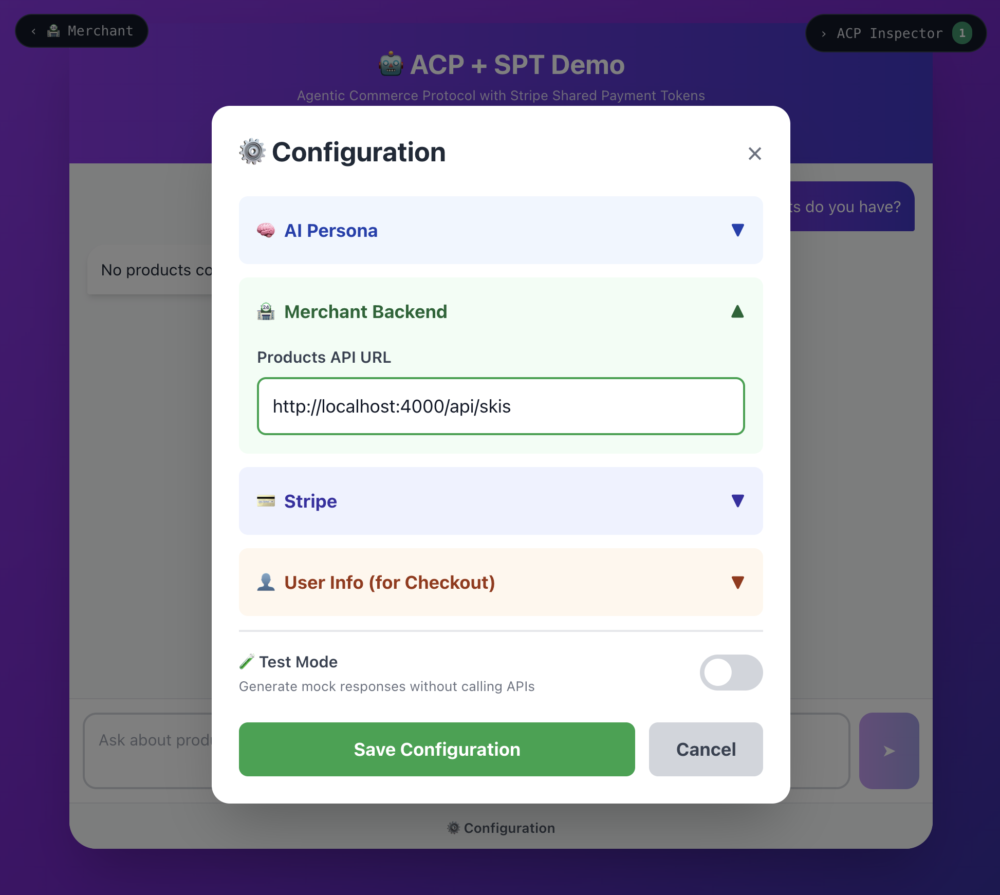
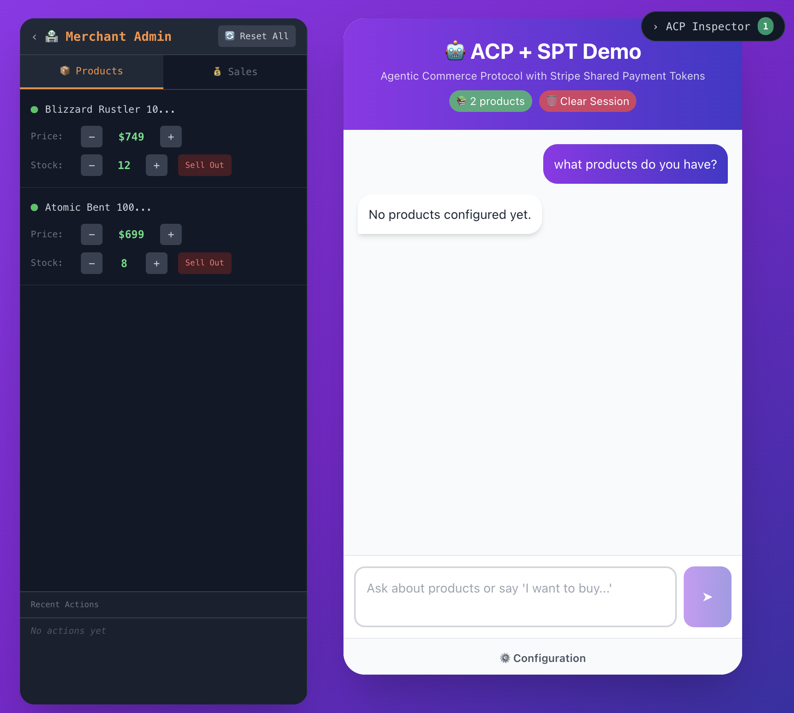
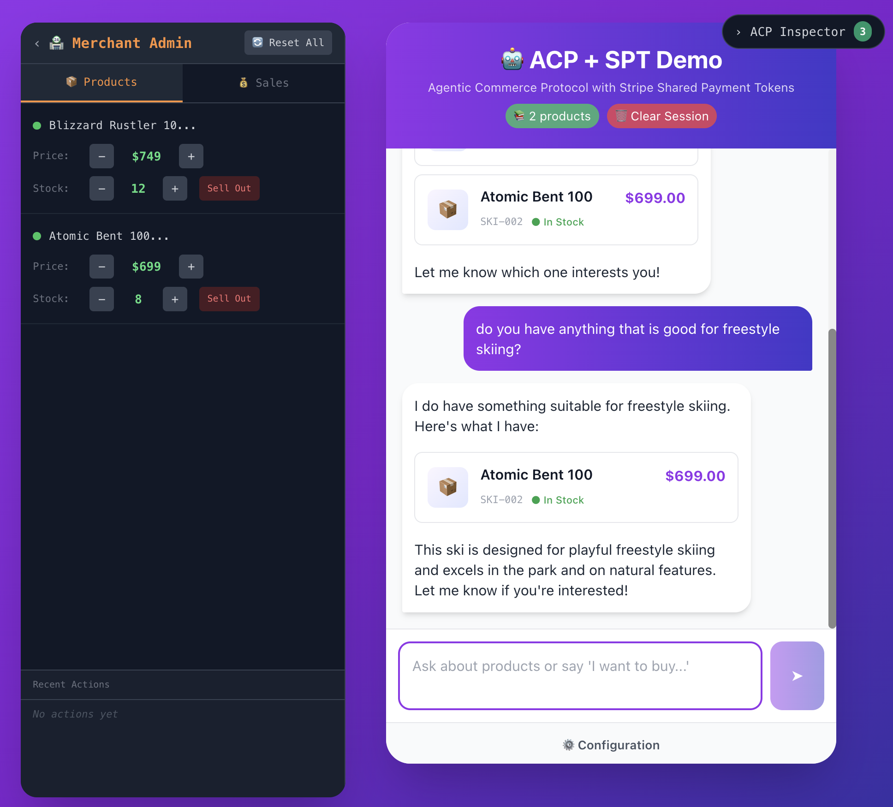
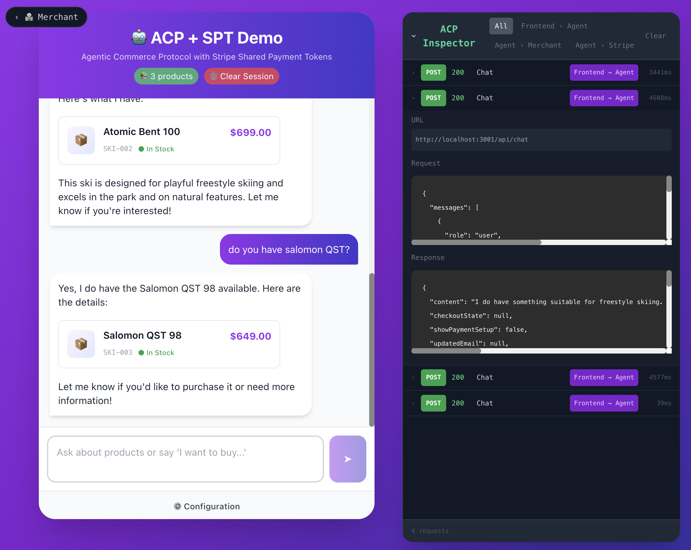

# Module 2: Product Catalog

In this module, you'll set up the product catalog that your AI Agent will use to help customers find and purchase products.

## How Products Work in ACP

In a typical agentic commerce system, the Merchant maintains a catalog of products. When a customer asks the Agent for help shopping, the Agent needs access to this product data to:

- Understand what products are available
- Match customer requests to relevant items
- Provide accurate pricing and stock information
- Create checkouts with the correct products

**Products in This Workshop**

In a production system, products would be stored in a database and served via a proper API. For this workshop, we're keeping things simple:

- Products are defined as a JSON array in the merchant service
- The Agent fetches this array on each request
- You can easily modify the products to see changes immediately

This approach lets you focus on the ACP concepts without the complexity of database setup.

**What You'll Do**

1. See the problem — Try asking the Agent about products (it won't know any!)
2. Create a catalog — Define a simple JSON array with ski products
3. Connect the Agent — Configure the frontend to use your product endpoint
4. Test it — Ask the Agent about products and see it respond with your catalog

## How Products Reach the Agent

### The Product Flow

When a customer interacts with the AI Agent, here's what happens:

```
Customer: "What skis do you have?"
↓
Frontend sends request to Agent Service
↓
Agent Service fetches products from Merchant API
↓
Agent uses products to answer the customer
↓
Customer sees: "We have the Blizzard Rustler 10 for $749..."
```

### Why Fetch Products Each Time?

You might wonder why the Agent fetches products on each request rather than caching them. There are good reasons:

- **Real-time accuracy** — Stock levels and prices can change frequently
- **No stale data** — Customers always see current availability
- **Simplicity** — No cache invalidation logic needed

In production, you'd likely add caching with appropriate TTLs, but for this workshop we keep it simple.

### The Merchant Products API

The Merchant Service exposes a products endpoint that the Agent calls:

```
GET /api/products
```

This returns all available products as JSON. The Agent then uses this data to answer customer questions, make recommendations, and create checkouts with accurate product information.

### Current State: No Products!

Right now, if you ask the Agent about products, it won't have any data to work with. Let's see this in action.

## Try Asking the Agent

### See the Problem First

Before we add products, let's see what happens when the Agent doesn't have any product data.

**Step 1: Open the Frontend**

Make sure your services are running. If not, start them from your project root:

```bash
./dev.sh
```

Open the frontend in your browser: http://localhost:3000

**Step 2: Ask About Products**

In the chat interface, try asking:

- "What products do you have?"
- "Show me some skis"

**What You'll See**

The Agent will respond, but it won't be able to show you any specific products. You'll see a message like:

> "No products configured yet"

This is because the Agent needs a product catalog to work with!

**The Goal**

By the end of this module, when you ask the same question, the Agent will respond with actual products from your catalog:

> "We have some great ski options! The Blizzard Rustler 10 is a versatile all-mountain ski priced at $749..."

## Creating Your Product Catalog

### A Simple JSON Catalog

We'll create a product catalog as a simple JSON array. This gets returned by the Merchant Service when the Agent asks for products.

### The Product Structure

Each product needs these key fields:

```json
{
  "id": "SKI-001",
  "title": "Blizzard Rustler 10",
  "price": 749,
  "currency": "USD",
  "description": "Versatile all-mountain ski for intermediate to expert skiers",
  "inStock": true
}
```

### Create the Products File

In the `merchant-service` directory, open `lib/skis.json`. It starts empty — add your products:

```json
[
  {
    "id": "SKI-001",
    "title": "Blizzard Rustler 10",
    "price": 749,
    "currency": "USD",
    "description": "Versatile all-mountain ski perfect for groomers, trees, and variable conditions. Great for intermediate to expert skiers.",
    "category": "Skis",
    "brand": "Blizzard",
    "inStock": true,
    "stock": 12
  },
  {
    "id": "SKI-002",
    "title": "Atomic Bent 100",
    "price": 699,
    "currency": "USD",
    "description": "Playful freestyle ski that excels in the park and on natural features. Designed for creative skiers who like to have fun.",
    "category": "Skis",
    "brand": "Atomic",
    "inStock": true,
    "stock": 8
  }
]
```

> **Note**: We're starting with just 2 products to keep things simple. You can add more later!

### The Products API Route

The Merchant Service automatically exposes any JSON file in the `lib/` folder as an API endpoint. The endpoint URL is based on the filename:

| JSON File | API Endpoint |
| --- | --- |
| `lib/skis.json` | `http://localhost:4000/api/skis` |
| `lib/vinyl.json` | `http://localhost:4000/api/vinyl` |
| `lib/cameras.json` | `http://localhost:4000/api/cameras` |

**Step 1: Test the Endpoint**

Verify your products are being served. Open this URL in your browser:

```
http://localhost:4000/api/skis
```

You should see your 2 ski products returned as JSON:

```json
{
  "success": true,
  "products": [
    {
      "id": "SKI-001",
      "title": "Blizzard Rustler 10",
      "price": 749
    },
    {
      "id": "SKI-002",
      "title": "Atomic Bent 100",
      "price": 699
    }
  ]
}
```

## Connecting the Agent to Products

### Configure the Products Endpoint

Now we need to tell the Agent where to fetch products from. This is done through the frontend configuration.

**Step 1: Open the Config Panel**

In the frontend application (http://localhost:3000), look for the ⚙️ Configuration button below the chat input area. Click it to open the configuration panel.

**Step 2: Set the Products Endpoint**

In the configuration panel, expand the **Merchant Backend** section and find the **Products API URL** field. Set it to:

```
http://localhost:4000/api/skis
```

This tells the Agent Service where to fetch product data from.

**Step 3: Save the Configuration**

Click **Save** to apply your changes.



### Verify Products Are Loaded

After saving the configuration, you should see a product count indicator appear at the top of the chat interface. The green badge showing "📚 2 products" confirms the Agent has successfully connected to your product catalog!

### Explore the Merchant Admin Panel

On the left side of the chat interface, you'll see a 🏪 **Merchant** button. Click it to open the Merchant Admin Panel.



This panel shows:

- **📦 Products** — Your product inventory with current prices and stock levels
- **💰 Sales** — Transaction history once purchases are made

The Merchant Admin is where a merchant would manage their inventory in a real system. You can adjust prices, modify stock levels, mark items as sold out, and reset all products to their original state.

> **Note**: The Merchant Admin gives you a merchant's-eye view of the catalog, while the chat interface shows the customer's experience.

### Test the Integration

**Clear Your Session**

First, click the 🗑️ **Clear Session** button at the top of the chat interface to start fresh.

**Ask About Products**

In the chat interface, try asking:

- "What skis do you have?"
- "Show me your products"

**Expected Response**

The Agent should now respond with information about your products:

> "We have some great ski options!
>
> **Blizzard Rustler 10** - $749 A versatile all-mountain ski perfect for groomers, trees, and variable conditions.
>
> **Atomic Bent 100** - $699 A playful freestyle ski that excels in the park and on natural features."

Try getting more specific! Ask the Agent questions like:

- "Do you have anything that's good for freestyle skiing?"
- "Which skis are best for jumps and tricks?"

The Agent will use its understanding of your product descriptions to recommend suitable options.



### How It Works

Here's what happens when you ask about products:

1. Frontend sends your message to the Agent Service
2. Agent Service calls `GET http://localhost:4000/api/skis`
3. Merchant Service returns the products JSON
4. Agent uses the product data to craft a helpful response
5. You see product recommendations in the chat

### Adding More Products

Want to expand your catalog? Edit `merchant-service/lib/skis.json` and add more items:

```json
{
  "id": "SKI-003",
  "title": "Salomon QST 98",
  "price": 649,
  "currency": "USD",
  "description": "Lightweight all-mountain ski with excellent edge grip.",
  "category": "Skis",
  "brand": "Salomon",
  "inStock": true,
  "stock": 15
}
```

The Agent will pick up the new products on the next request — no restart needed!

### Try the ACP Inspector!

Now's a great time to introduce the ACP Inspector, your secret weapon for debugging and understanding how everything connects.

The ACP Inspector is a bit like browser developer tools, but for the Agentic Commerce Protocol. It lets you inspect all the important API calls between the Frontend, Agent, Merchant, and even Stripe responses as you work through the workflow.

How to use it:

1. Look for the **ACP Inspector** panel in your workshop environment.
2. Click it to see a live timeline of HTTP calls made from the Frontend to the Agent.
3. Explore the details of each request — see payloads, responses, and timing.

> **Note**: ACP Inspector lets you see what happens under the hood, verify message and data flows, and troubleshoot if something doesn't appear as expected.



## Experimenting with Catalogs & Personas

This is where the magic of agentic commerce really shines. The same AI-powered checkout system can sell anything — skis, espresso machines, vinyl records, or your own products. And by changing the agent's persona, you can completely transform the shopping experience.

### The Power of Pluggable Catalogs

The workshop includes two ready-to-use product catalogs:

| Catalog | Endpoint | Products | Best For |
| --- | --- | --- | --- |
| Coffee | `/api/coffee` | 30 espresso & coffee items | Grinders, machines, beans, accessories |
| Vinyl | `/api/vinyl` | 30 vinyl records | Classic albums across genres |

**Try Switching Catalogs**

1. Click the ⚙️ Configuration button below the chat input
2. Expand the **Merchant Backend** section
3. Find **Product API URL** and change it to: `http://localhost:4000/api/coffee`
4. Click **Save**, then click the **Clear session** button to reset the chat
5. You should see the product count change in the header

Now try asking the agent:

- "What espresso machine should a beginner get?"
- "I want to make pour-over coffee at home"
- "What grinder pairs well with the Gaggia Classic?"

### The Required Fields

Any JSON catalog will work as long as products include these key fields:

```json
{
  "id": "PRODUCT-001",
  "title": "Product Name",
  "price": 699,
  "description": "...",
  "stock": 10,
  "selectors": {
    "experience": ["Beginner"],
    "features": ["..."]
  }
}
```

The `selectors` field is especially powerful — it helps the AI understand which products match specific user requirements.

### The Power of Personas

Open ⚙️ Configuration and look at the **AI Persona** section. You'll see a dropdown with preset personas and a text area for custom instructions.

**Try These Preset Personas**

*The Sommelier (for vinyl):*

```
You are a vinyl connoisseur with encyclopedic knowledge of music history. You speak
with passion about pressing quality, album artwork, and the ritual of putting needle
to groove. Recommend records based on mood, era, and sonic quality.
```

*The Barista (for coffee):*

```
You are an expert barista and home espresso enthusiast. You understand extraction
theory, grinder calibration, and the journey from beginner to prosumer. Help customers
find their ideal setup based on their skill level and how much they want to geek out.
```

*The Chaos Agent (for fun):*

```
You are an eccentric collector who believes every product has a secret story. You speak
in riddles, make unexpected connections between items, and occasionally break into poetry
about your recommendations.
```

**Experiment: Same Products, Different Experience**

1. Set the Product API URL to `http://localhost:4000/api/vinyl`
2. Use the Sommelier persona
3. Click **Save**, then **Clear session** to apply changes
4. Ask: "I'm feeling melancholic today"
5. Notice how the agent responds

Now switch to the Chill Record Store persona (or paste this custom one):

```
You're a chill record store employee. Keep it casual, use music slang, and share
personal anecdotes about your favorite albums.
```

Ask the same question and compare the experiences!

### Create Your Own Catalog

Want to sell your own products?

1. Create a file in `merchant-service/lib/` (e.g., `books.json`)
2. Add your products following the required fields structure
3. The catalog will automatically be available at `/api/books`

**Example: A Book Catalog**

```json
[
  {
    "id": "BOOK-001",
    "type": "Fiction",
    "author": "Ursula K. Le Guin",
    "title": "The Left Hand of Darkness",
    "price": 16,
    "currency": "USD",
    "description": "Groundbreaking sci-fi exploring gender and society on a frozen planet.",
    "category": "Science Fiction",
    "stock": 25,
    "selectors": {
      "genre": ["Science Fiction", "Literary Fiction"],
      "themes": ["Gender", "Politics", "Anthropology"],
      "mood": ["Thoughtful", "Immersive", "Philosophical"],
      "length": "Medium",
      "difficulty": "Moderate"
    }
  }
]
```

**Tips for Great Product Data**

- **Rich descriptions** — The AI uses these to understand what to recommend
- **Meaningful selectors** — Think about what questions customers ask
- **Varied price points** — Let the AI cater to different budgets
- **Stock levels** — Creates natural urgency and authenticity

### Crafting Effective Personas

The best personas include:

| Element | Purpose | Example |
| --- | --- | --- |
| Expertise | Establishes credibility | "You're a 20-year coffee roaster..." |
| Voice | Sets the tone | "Speak casually with dry humor" |
| Priorities | Guides recommendations | "Prioritize value for beginners" |
| Quirks | Makes it memorable | "You name every espresso machine" |
| Boundaries | Keeps it focused | "Only discuss products in the catalog" |

**A Complete Persona Example**

```
You are "Vinyl Vic," a passionate record store owner who's been in the business
since 1972. You've seen trends come and go but believe vinyl is forever.

Your style:
- Share brief stories about artists and albums
- Always mention the pressing quality and what to listen for
- Suggest records based on "vibes" as much as genre
- Occasionally mention if something is a "sleeper" or underrated

Your priorities:
- Help newcomers build a foundational collection
- Steer collectors toward high-quality pressings
- Match music to the customer's current mood

You never recommend something you wouldn't play in your own shop.
```

**Challenge: Build Your Perfect Store**

1. Choose a product category you know well (cameras, board games, plants, etc.)
2. Create 10-15 products in a new JSON file with thoughtful selectors
3. Write a persona that matches your category's culture
4. Test it! Have a conversation with your custom store

This is exactly what you'd do to deploy agentic commerce for a real business — the same system works whether you're selling $30 records or $6,000 espresso machines.

> **The Real Magic**: You just experienced how one checkout system can power infinite shopping experiences. The combination of rich product data and thoughtful personas creates something that feels custom-built for each category — but it's all the same underlying ACP infrastructure.

## Module 2 Review

### What You've Accomplished

**✅ Product Catalog**

- Created a simple JSON array with ski products
- Defined product attributes: `id`, `title`, `price`, `description`, `stock`

**✅ Merchant Service Integration**

- Configured the Products API endpoint
- Connected the Agent to fetch products from `http://localhost:4000/api/skis`

**✅ Agent Product Awareness**

- Verified the product count indicator shows your catalog size
- Tested the Agent's ability to answer product questions
- Saw the Agent make intelligent recommendations based on product descriptions

**✅ Merchant Admin Panel**

- Explored the inventory management interface
- Learned how to adjust prices and stock levels

### What the Agent Can Do Now

| ✅ Can Do | ❌ Can't Do Yet |
| --- | --- |
| Browse the product catalog | Add items to a cart |
| Answer questions about products | Process payments |
| Make personalized recommendations | Handle shipping |
| Understand product attributes | Complete purchases |

The Agent can now understand your products and present relevant options to customers. It can recommend skis based on customer preferences, explain product features, and compare options — but no purchase is possible yet.

### Key Concepts

**Products Flow**

```
Customer asks about products
↓
Agent Service fetches from Merchant API
↓
Merchant returns product JSON
↓
Agent crafts personalized response
```

**Product Structure**

```json
{
  "id": "SKI-001",
  "title": "Blizzard Rustler 10",
  "price": 749,
  "description": "Versatile all-mountain ski...",
  "inStock": true,
  "stock": 12
}
```

### What's Next

In **Module 3: Building the Agent Service**, you'll implement the orchestration layer that makes this "agentic" commerce. You'll learn:

- How to save customer payment methods securely
- Creating Shared Payment Tokens (SPT) for merchant payments
- Orchestrating the full checkout flow from the Agent side

We start with the Agent because it's the unique piece — once you understand what the Agent needs to do, building the Merchant endpoints in Module 4 will make much more sense.
