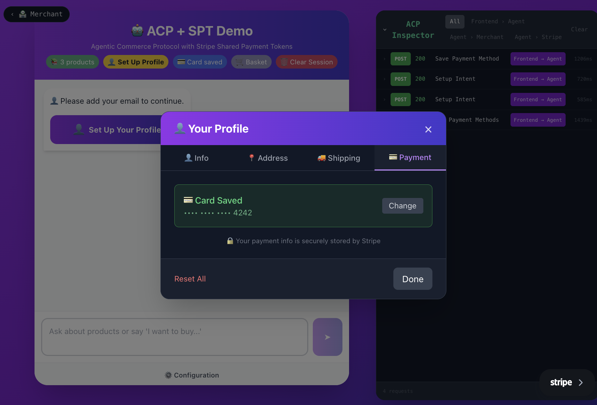

# Module 3: Building the Agent Service

The Agent Service is the orchestrator of the agentic commerce flow. It receives user requests, uses AI to understand intent, and coordinates with the Merchant Service for checkout operations.

## What's Already Set Up

The starter kit includes a working Agent Service with:

- ✅ Express server (`server.js`)
- ✅ AI chat integration (`routes/chat.js`)
- ✅ Payment and checkout route structure
- ✅ ACP call logging for the Inspector

## What You'll Build

You'll implement the exported helper functions that the chat handler calls when users want to make purchases:

| File | Functions to Implement |
| --- | --- |
| `routes/payment.js` | `getCustomerPaymentMethods()`, `createSPT()` |
| `routes/checkout.js` | `createCheckout()`, `getCheckout()`, `updateCheckout()`, `completeCheckout()`, `cancelCheckout()` |

You'll also complete the frontend payment form to collect card details:

| File | TODOs to Complete |
| --- | --- |
| `frontend/components/PaymentSetup.tsx` | Stripe hooks, `createPaymentMethod()`, Elements wrapper |

## Architecture

```
┌──────────────┐     ┌──────────────────────┐     ┌─────────────────┐
│   Frontend   │────►│   Agent Service      │────►│ Merchant Service│
│              │◄────│   (this module)      │◄────│ (Module 4)      │
└──────────────┘     └──────────┬───────────┘     └─────────────────┘
                                │
                   ┌────────────┴────────────┐
                   │                         │
            ┌──────▼──────┐         ┌────────▼───────┐
            │ AI Service  │         │ Stripe Proxy   │
            │ (OpenAI)    │         │ (Lambda)       │
            └─────────────┘         └────────────────┘
```

## Module Objectives

By the end of this module, you'll have:

- ✅ Frontend payment form collecting cards securely
- ✅ SPT creation from saved payment methods
- ✅ Checkout orchestration calling Merchant APIs
- ✅ Complete end-to-end purchase flow working!

> **Note**: This module will take approximately 60 minutes to complete.

## Agent Service Overview

### Project Structure

```
agent-service/
├── routes/
│   ├── chat.js       # AI communication (working)
│   ├── checkout.js   # ACP checkout calls (has TODOs)
│   └── payment.js    # SPT creation (has TODOs)
├── lib/
│   └── acp-call-logger.js  # Request logging for ACP Inspector
├── server.js         # Express server (working)
├── package.json      # Dependencies (installed)
└── .env              # Configuration (set by dev.sh)
```

### What's Working

| Component | Status | Purpose |
| --- | --- | --- |
| `server.js` | ✅ Working | Express server with all routes mounted |
| `chat.js` | ✅ Working | AI chat with product recommendations |
| Route endpoints | ✅ Working | All Express routes are defined |
| ACP logging | ✅ Working | Logs calls for the Inspector |

### What You'll Implement

The exported helper functions in these files have TODO stubs:

| File | Functions to Implement |
| --- | --- |
| `checkout.js` | `createCheckout`, `getCheckout`, `updateCheckout`, `completeCheckout`, `cancelCheckout` |
| `payment.js` | `getCustomerPaymentMethods`, `createSPT` |

These functions are called by the AI chat handler when the user wants to make a purchase.

> **Note**: This module walks through the code structure first, showing you where the TODOs are. You'll implement them step-by-step in the upcoming chapters — don't jump ahead!

### How It Works

When you chat with the Agent:

1. AI understands intent — "I want to buy skis" → triggers checkout flow
2. Chat handler calls your functions — `createCheckout()`, `updateCheckout()`, etc.
3. Your functions call the Merchant — via the ACP protocol
4. SPT enables payment — your `createSPT()` generates the payment token

```
User Chat → AI → chat.js → checkout.js → Merchant Service
                                ↓
                          payment.js → Stripe (SPT)
```

### Learn More: How AI Function Calling Works

#### What is Function Calling?

The AI Service uses OpenAI's function calling feature to determine what actions to take. Instead of just generating text, it can identify user intent and return structured actions.

#### Tool Definitions

The AI Lambda defines "tools" the AI can use:

```js
const tools = [
  {
    type: "function",
    function: {
      name: "create_checkout",
      description: "Create a checkout session when user wants to buy products",
      parameters: {
        type: "object",
        properties: {
          items: {
            type: "array",
            items: {
              type: "object",
              properties: {
                id: { type: "string", description: "Product ID" },
                quantity: { type: "number", description: "Quantity" }
              },
              required: ["id", "quantity"]
            }
          }
        },
        required: ["items"]
      }
    }
  },
  {
    type: "function",
    function: {
      name: "update_checkout",
      description: "Update checkout with shipping address or fulfillment option",
      // ... parameters
    }
  },
  {
    type: "function",
    function: {
      name: "complete_checkout",
      description: "Complete the checkout and process payment",
      // ... parameters
    }
  }
];
```

#### AI Response with Tool Call

When the user says "I'll take the Rustler 10", the AI returns:

```json
{
  "response": "Great choice! I've added the Blizzard Rustler 10 to your cart.",
  "tool_calls": [
    {
      "function": {
        "name": "create_checkout",
        "arguments": "{\"items\": [{\"id\": \"SKI-001\", \"quantity\": 1}]}"
      }
    }
  ]
}
```

#### The Agent Executes Tool Calls

The `chat.js` handler receives this and executes the corresponding action:

```js
if (aiResult.tool_calls) {
  for (const call of aiResult.tool_calls) {
    const { name, arguments: args } = call.function;
    const params = JSON.parse(args);

    switch (name) {
      case 'create_checkout':
        await handleCreateCheckout(params);
        break;
      case 'update_checkout':
        await handleUpdateCheckout(params, checkoutId);
        break;
      case 'complete_checkout':
        await handleCompleteCheckout(checkoutId, email);
        break;
    }
  }
}
```

#### Benefits of Function Calling

1. **Structured output** — Guaranteed JSON schema, not free-form text
2. **Reliable actions** — No need to parse natural language
3. **Type safety** — Defined parameters and types
4. **Fallback** — AI can also just respond with text when no action is needed

### Environment Variables

The `dev.sh --setup` script configured these for you:

```bash
# In agent-service/.env

# Lambda endpoint (the shared AI brain)
LAMBDA_ENDPOINT=https://...

# Agent's Stripe account (via Proxy URL)
STRIPE_PROXY_URL=https://...

# Workshop authentication
WORKSHOP_SECRET=...

# Agent's Stripe publishable key (for frontend)
STRIPE_PUBLISHABLE_KEY=pk_test_...

# Merchant Service URL
MERCHANT_API_URL=http://localhost:4000

# Server port
PORT=3001
```

The Agent uses a proxy for Stripe calls to keep secret keys secure. You don't need to handle API keys directly.

## Payment Method Management

### Overview

The Agent needs to store user payment methods securely with Stripe. When it's time to pay, the Agent creates an SPT from the stored payment method.

> **Warning**: Security Note for Production: This demo stores user profiles (including payment method references) entirely in browser localStorage — without any authentication. In production, you would require user login, store payment methods server-side with authenticated user IDs, and verify ownership before creating SPTs. We skip authentication in this workshop to keep the focus on ACP and SPT concepts.

### Payment Flow

```
Frontend                     Agent                 Agent's Stripe
│                           │                           │
│ 1. Request SetupIntent    │                           │
│──────────────────────────►│                           │
│                           │ 2. Create Customer        │
│                           │──────────────────────────►│
│                           │        cus_xxx            │
│                           │◄──────────────────────────│
│                           │ 3. Create SetupIntent     │
│                           │──────────────────────────►│
│      client_secret        │        seti_xxx           │
│◄──────────────────────────│◄──────────────────────────│
│                           │                           │
│ 4. Collect card with      │                           │
│    Stripe Elements        │                           │
│                           │                           │
│ 5. Confirm SetupIntent    │                           │
│──────────────────────────────────────────────────────►│
│                           │        pm_xxx             │
│◄──────────────────────────────────────────────────────│
│                           │                           │
│ 6. Save payment method    │                           │
│──────────────────────────►│                           │
│                           │ Store: email → pm_xxx     │
│      ✅ Saved             │                           │
│◄──────────────────────────│                           │
```

> **Note**: Payment methods are stored on the Agent's Stripe account, not the Merchant's. This is a key security feature — the Merchant never sees card details.

### The Starter File

Open `agent-service/routes/payment.js` — the starter kit already includes a working payment routes file that handles:

- `GET /api/payment/config` — Returns Stripe publishable key
- `POST /api/payment/setup-intent` — Creates SetupIntent for card collection
- `POST /api/payment/save-method` — Stores payment method for user
- `GET /api/payment/methods` — Lists saved payment methods

These routes work through a Stripe Proxy Lambda function that keeps secret keys secure.

### What's Already Working

The payment routes use a `callProxy` helper to make authenticated Stripe calls:

```js
async function callProxy(path, options = {}) {
  const proxyUrl = process.env.STRIPE_PROXY_URL;
  if (!proxyUrl) {
    throw new Error('STRIPE_PROXY_URL not configured');
  }

  const url = `${proxyUrl}${path}`;
  const response = await fetch(url, {
    ...options,
    headers: {
      'Content-Type': 'application/json',
      ...options.headers,
    },
  });

  return await response.json();
}
```

This pattern keeps the Agent's Stripe secret key in the secure Lambda, not in the main Agent service.

### What You Need to Implement

At the bottom of the file, you'll find two stubbed exports:

```js
/**
 * Get customer's saved payment methods via proxy
 *
 * TODO: Implement getCustomerPaymentMethods function
 * - Call the proxy: /methods?email=${encodeURIComponent(email)}
 * - Return data.paymentMethods array
 */
export async function getCustomerPaymentMethods(email) {
  // TODO: Implement this function
  // Call: callProxy(`/methods?email=${encodeURIComponent(email)}`)
  // Return: data.paymentMethods || []
  throw new Error('TODO: Implement getCustomerPaymentMethods - see workshop Module 3, Chapter 5');
}

/**
 * Create a Shared Payment Token (SPT)
 *
 * TODO: Implement SPT creation
 * - Call the proxy to create an SPT with the user's payment method
 * - POST /create-spt with { email, amount, currency }
 * - Return the SPT token for use in checkout completion
 */
export async function createSPT(email, amount = 100000, currency = 'usd') {
  // TODO: Implement this function
  // Call: callProxy('/create-spt', { method: 'POST', body: JSON.stringify({ email, amount, currency }) })
  // Check for errors in response
  // Return the SPT data (contains .token property)
  throw new Error('TODO: Implement createSPT - see workshop Module 3, Chapter 5');
}
```

> **Note**: Don't implement these yet! We're just exploring the code structure here. You'll implement these functions in the Creating Shared Payment Tokens chapter.

These functions are imported by the chat handler to enable AI-driven payments. The routes themselves are working — it's just the exported helper functions that need implementation for the AI chat flow.

## Frontend Payment Setup

Before we implement the Agent's payment helper functions, let's build the frontend component that collects payment details from users. This is where Stripe.js comes in.

The Agent's payment routes (`/api/payment/*`) already exist in the starter kit — they handle saving payment methods and creating SPTs. But first, we need a way for users to securely enter their payment information.

The starter kit includes `frontend/components/PaymentSetup.tsx` with TODO placeholders — you'll complete these in the next chapter.

### How It Works

The frontend uses Stripe Payment Element to securely collect payment information:

```
User                    Frontend               Agent Service      Agent's Stripe
│                        │                        │                    │
│ 1. Click "Add Card"    │                        │                    │
│───────────────────────►│                        │                    │
│                        │                        │                    │
│                        │ 2. POST /setup-intent  │                    │
│                        │───────────────────────►│                    │
│                        │    { clientSecret }    │                    │
│                        │◄───────────────────────│                    │
│                        │                        │                    │
│ 3. PaymentElement UI   │                        │                    │
│◄───────────────────────│                        │                    │
│                        │                        │                    │
│ 4. Enter payment info  │                        │                    │
│───────────────────────►│                        │                    │
│                        │ 5. confirmSetup()      │                    │
│                        │────────────────────────────────────────────►│
│                        │    setupIntent.payment_method               │
│                        │◄────────────────────────────────────────────│
│                        │                        │                    │
│                        │ 6. POST /save-method   │                    │
│                        │───────────────────────►│                    │
│                        │        ✅ Saved        │                    │
│                        │◄───────────────────────│                    │
│                        │                        │                    │
│ 7. "Card saved!" ✅    │                        │                    │
│◄───────────────────────│                        │                    │
```

> **Key point**: Payment details never touch your servers. They go directly to Stripe via the Payment Element.

### What is Payment Element?

**Payment Element** is Stripe's all-in-one UI component for collecting payment information. It's the recommended way to build payment forms in 2024+.

Payment Element is a single, intelligent component that:

- **Shows the right payment methods** — Automatically displays options based on the customer's location, device, and your Stripe Dashboard settings
- **Handles complexity for you** — Bank redirects, 3D Secure authentication, and wallet integrations all work automatically
- **Stays up to date** — As Stripe adds new payment methods or regulations change, Payment Element updates without you changing code
- **Optimizes conversion** — Stripe continuously A/B tests the UI to maximize successful payments
- **Supports 40+ payment methods** — Cards, Apple Pay, Google Pay, bank transfers, Klarna, Afterpay, iDEAL, and many more

In contrast, the older **CardElement** only supports card payments and requires separate integrations for each wallet or alternative payment method.

### Payment Element vs Card Element

| Feature | CardElement | PaymentElement |
| --- | --- | --- |
| Payment types | Cards only | Cards, wallets, bank transfers, BNPL |
| UI | Single card input | Tabbed/accordion with multiple options |
| Setup | Manual field access | Automatic with SetupIntent |
| Apple/Google Pay | Separate integration | Built-in (if enabled) |
| Future payment methods | Manual updates | Automatic |

We'll use PaymentElement for a more modern, comprehensive experience.

### The Stripe.js Packages

The starter kit already has these packages installed:

- `@stripe/stripe-js` — Loads Stripe.js and initializes it with your publishable key
- `@stripe/react-stripe-js` — React components including Elements wrapper and PaymentElement

### Key Concepts

Before we dive into the code, let's understand the key pieces:

1. **`loadStripe()`**: Initializes Stripe.js with your publishable key. The publishable key is safe to include in frontend code — it can only be used for read operations and creating tokens, not charging cards.

2. **SetupIntent**: A SetupIntent is created server-side and provides a `clientSecret` that authorizes the frontend to collect payment details.

3. **The Elements Provider**: Wraps your payment form and provides Stripe context to child components. For PaymentElement, it needs the `clientSecret`.

4. **Stripe Hooks**: Inside the Elements wrapper, you can use these hooks:

   | Hook | Purpose |
   | --- | --- |
   | `useStripe()` | Access the Stripe object for API calls |
   | `useElements()` | Access the Elements instance |

5. **PaymentElement**: A pre-built, secure UI that shows available payment methods. Payment details entered here go directly to Stripe — they never touch your server.

### What You'll Build

In the next chapter, you'll complete the TODO placeholders in `PaymentSetup.tsx` to:

- ✅ Initialize Stripe with `loadStripe()`
- ✅ Create a SetupIntent and get the `clientSecret`
- ✅ Use the `useStripe()` and `useElements()` hooks
- ✅ Call `stripe.confirmSetup()` to save the payment method
- ✅ Save the payment method ID to the Agent backend
- ✅ Wrap everything in the Elements provider with appearance customization

## The Payment Form Component

Open `frontend/components/PaymentSetup.tsx` — you'll see a starter file with TODO placeholders. Let's complete each one to build a working payment form.

### Step 1: Add the Stripe Hooks

Find this TODO for the `SetupForm` component:

```ts
// TODO: Use the useStripe() and useElements() hooks
const stripe = null;    // Replace with: useStripe();
const elements = null;  // Replace with: useElements();
```

Replace with:

```ts
const stripe = useStripe();
const elements = useElements();
```

These hooks give you access to:

- `stripe` — The Stripe.js object for confirming the setup
- `elements` — The Elements instance (used internally by PaymentElement)

### Step 2: Confirm the Setup

Find this TODO section in `handleSubmit`:

```ts
// TODO: Confirm the SetupIntent with the PaymentElement
const submitError = { message: 'TODO: Implement confirmSetup' };
const setupIntent = null;
```

Replace with:

```ts
const { error: submitError, setupIntent } = await stripe.confirmSetup({
  elements,
  confirmParams: {
    return_url: window.location.href,
  },
  redirect: 'if_required',
});
```

This collects payment details from the PaymentElement, sends them directly to Stripe (never touching your server!), confirms the SetupIntent, and returns the confirmed `setupIntent` with the `payment_method` ID.

The `redirect: 'if_required'` option prevents unnecessary redirects for card payments.

### Step 3: Save to the Agent Backend

Find the TODO and uncomment the code below it:

```ts
// TODO: Save the payment method to the Agent backend
```

```ts
// Always use session customer ID (GUID-based, not email)
// Email is separate profile info for receipts only
const customerId = getOrCreateCustomerId();
const paymentMethodId = typeof setupIntent.payment_method === 'string'
  ? setupIntent.payment_method
  : setupIntent.payment_method.id;

console.log('💳 Saving payment method for session customer:', customerId);
await savePaymentMethod(customerId, paymentMethodId);
onSuccess(paymentMethodId);  // ← Important! Closes the modal
```

> **Note**: Each browser session gets a unique customer ID (like `cust_abc123@session.local`). This ID stays consistent throughout the session but resets when you "Clear Session". No email required to save cards!

This calls the Agent's `/api/payment/save-method` endpoint to store the payment method ID. The `onSuccess()` call signals that saving was successful and closes the modal. Later, the Agent uses this saved payment method to create SPTs.

### Step 4: Load Stripe and Create SetupIntent

In the main `PaymentSetup` component, find this TODO:

```ts
// TODO: Load Stripe with the publishable key
setStripePromise(null); // Replace with: setStripePromise(loadStripe(publishableKey));
```

Replace with:

```ts
setStripePromise(loadStripe(publishableKey));
```

Then find:

```ts
// TODO: Create a SetupIntent and get the clientSecret
setClientSecret(null);
```

Replace with:

```ts
// Always use session customer ID (GUID-based, auto-generated)
const customerId = getOrCreateCustomerId();
console.log('🆔 Creating SetupIntent for session customer:', customerId);
const setupIntent = await createSetupIntent(customerId);
setClientSecret(setupIntent.clientSecret);
```

This creates a SetupIntent using the session customer ID and gets the `clientSecret` needed for PaymentElement.

### Step 5: Wrap with Elements Provider

Find the TODO near the return statement:

```tsx
{/* TODO: Wrap SetupForm with Elements provider */}
{/* Include clientSecret and appearance in options */}
<SetupForm onSuccess={onSuccess} onCancel={onCancel} email={email} />
```

Replace with:

```tsx
<Elements
  stripe={stripePromise}
  options={{
    clientSecret,
    appearance,
  }}
>
  <SetupForm onSuccess={onSuccess} onCancel={onCancel} email={email} />
</Elements>
```

The Elements provider makes Stripe available to all child components via hooks, passes the `clientSecret` to authorize the PaymentElement, and applies the custom appearance theme.

### Test It Now!

You can test your payment form right away — no need to wait for the full checkout flow!

1. Look at the header of the chat interface
2. Click the 👤 **Profile** button (or "Set Up Profile" if not yet configured)
3. In the Profile Settings modal, click the **💳 Payment** tab
4. The PaymentSetup component you just built will appear
5. Click **Add Payment Method**

**Using the Stripe Test Helper**

Look for the **STRIPE** button in the bottom-right corner of the Payment Element! This is Stripe's built-in test helper that makes testing easy:

1. Click the **STRIPE** button
2. You'll see a menu of test scenarios:
   - ✅ Successful payment — Use this for a happy path test
   - ❌ Declined card — Simulates a declined payment
   - 🔐 3D Secure required — Tests authentication flows
3. Select "Fill in a successful test card" (or similar)
4. The form auto-fills with test card `4242 4242 4242 4242`
5. Click "Save Payment Method"



> **Note**: The STRIPE test helper only appears in test mode (when using `pk_test_` keys). It's a huge time-saver for testing different scenarios without memorizing test card numbers!

You should see:

- ✅ Payment method saved successfully
- The Profile button in the header shows **Profile ✓** indicating your profile is complete
- Check your terminal — you'll see logs from the Agent Service showing the payment method was saved!

This payment method will be used later when you complete the full checkout flow.

## Creating Shared Payment Tokens

### SPT Creation Flow

When the Agent is ready to complete a checkout, it creates an SPT from the user's saved payment method on the Agent's Stripe account:

```
Agent                              Agent's Stripe              Merchant
│                                      │                        │
│ Create SPT from pm_xxx               │                        │
│─────────────────────────────────────►│                        │
│                                      │                        │
│      spt_xxx (valid for 1 hour)      │                        │
│◄─────────────────────────────────────│                        │
│                                      │                        │
│ POST /checkouts/:id/complete         │                        │
│ (with SPT token)                     │                        │
│─────────────────────────────────────────────────────────────►│
│                                      │                        │
```

The SPT allows the Merchant to charge the payment method via their own Stripe account.

### Implementing the Helper Functions

Open `agent-service/routes/payment.js` and find the stubbed exports at the bottom of the file.

#### getCustomerPaymentMethods

Find this stub and replace it with:

```js
export async function getCustomerPaymentMethods(email) {
  const data = await callProxy(`/methods?email=${encodeURIComponent(email)}`);
  return data.paymentMethods || [];
}
```

#### createSPT

This is the key function! Find this stub and replace it with:

```js
export async function createSPT(email, amount = 100000, currency = 'usd') {
  const data = await callProxy('/create-spt', {
    method: 'POST',
    body: JSON.stringify({ email, amount, currency }),
  });

  if (data.error) {
    throw new Error(data.error);
  }

  console.log('🔐 SPT created for', email);
  return data;
}
```

### How createSPT Works

The proxy service handles the actual Stripe API call:

1. Looks up the customer by email
2. Gets their saved payment method (the `pm_xxx` from earlier)
3. Creates an SPT using the Stripe test helper endpoint
4. Returns the token to the Agent

The SPT can then be sent to any Merchant's Stripe account for payment — the Merchant never sees the actual card details.

### The API Route

The file already includes an API route that calls your helper:

```js
router.post('/create-spt', async (req, res) => {
  try {
    const { email, amount = 100000, currency = 'usd' } = req.body;

    if (!email) {
      return res.status(400).json({ error: 'Email required' });
    }

    const sptResult = await createSPT(email, amount, currency);
    res.json(sptResult);

  } catch (error) {
    console.error('Create SPT error:', error);
    res.status(500).json({ error: error.message });
  }
});
```

### What's Next

You've implemented the payment helper functions! These will be called automatically during the checkout flow:

1. When a user tries to complete a purchase...
2. The AI chat handler calls `createSPT()` with their email
3. Your function calls the proxy to generate an SPT
4. The SPT is passed to the Merchant for payment

We'll test everything together at the end of this module when the complete checkout flow is working!

## Checkout Orchestration

The Agent's checkout routes call the Merchant's ACP endpoints. The starter file has the structure in place — you need to implement the helper functions.

### The Starter File

Open `agent-service/routes/checkout.js` — you'll see the Express routes are already defined, but they call helper functions that throw TODO errors. Find the stubbed exports at the bottom of the file.

### Implementing createCheckout

Find this stub and replace it with:

```js
export async function createCheckout(items, buyer, merchantUrl) {
  const body = { items };
  if (buyer) body.buyer = buyer;

  const response = await loggedACPFetch(`${merchantUrl}/checkouts`, {
    method: 'POST',
    headers: { 'Content-Type': 'application/json' },
    body: JSON.stringify(body),
  }, { endpoint: 'POST /checkouts', flow: 'Agent → Merchant' });

  if (!response.ok) {
    const error = await response.json();
    throw new Error(error.message || 'Failed to create checkout');
  }

  return await response.json();
}
```

### Implementing getCheckout

Find and replace the stub with:

```js
export async function getCheckout(checkoutId, merchantUrl) {
  const response = await loggedACPFetch(`${merchantUrl}/checkouts/${checkoutId}`, {
    method: 'GET',
  }, { endpoint: 'GET /checkouts/:id', flow: 'Agent → Merchant' });

  if (!response.ok) {
    const error = await response.json();
    throw new Error(error.message || 'Failed to get checkout');
  }

  return await response.json();
}
```

### Implementing updateCheckout

Find and replace the stub with:

```js
export async function updateCheckout(checkoutId, updates, merchantUrl) {
  // Convert camelCase to snake_case for ACP protocol
  const body = {};
  if (updates.items) body.items = updates.items;
  if (updates.buyer) body.buyer = updates.buyer;
  if (updates.fulfillmentAddress) body.fulfillment_address = updates.fulfillmentAddress;
  if (updates.fulfillmentOptionId) body.fulfillment_option_id = updates.fulfillmentOptionId;

  const response = await loggedACPFetch(`${merchantUrl}/checkouts/${checkoutId}`, {
    method: 'PUT',
    headers: { 'Content-Type': 'application/json' },
    body: JSON.stringify(body),
  }, { endpoint: 'PUT /checkouts/:id', flow: 'Agent → Merchant' });

  if (!response.ok) {
    const error = await response.json();
    throw new Error(error.message || 'Failed to update checkout');
  }

  return await response.json();
}
```

### Implementing completeCheckout

This is the key function that sends the SPT to the Merchant. Find and replace the stub with:

```js
export async function completeCheckout(checkoutId, paymentToken, merchantUrl) {
  const body = {
    payment_data: {
      token: paymentToken,
      provider: 'stripe'
    }
  };

  const response = await loggedACPFetch(`${merchantUrl}/checkouts/${checkoutId}/complete`, {
    method: 'POST',
    headers: { 'Content-Type': 'application/json' },
    body: JSON.stringify(body),
  }, { endpoint: 'POST /checkouts/:id/complete', flow: 'Agent → Merchant' });

  if (!response.ok) {
    const error = await response.json();
    throw new Error(error.message || 'Failed to complete checkout');
  }

  return await response.json();
}
```

### Implementing cancelCheckout

Find and replace the stub with:

```js
export async function cancelCheckout(checkoutId, reason, merchantUrl) {
  const response = await loggedACPFetch(`${merchantUrl}/checkouts/${checkoutId}/cancel`, {
    method: 'POST',
    headers: { 'Content-Type': 'application/json' },
    body: JSON.stringify({ reason }),
  }, { endpoint: 'POST /checkouts/:id/cancel', flow: 'Agent → Merchant' });

  if (!response.ok) {
    const error = await response.json();
    throw new Error(error.message || 'Failed to cancel checkout');
  }

  return await response.json();
}
```

### What You've Built

Your Agent can now orchestrate the entire checkout flow:

| Function | Calls | Purpose |
| --- | --- | --- |
| `createCheckout()` | `POST /checkouts` | Start a checkout |
| `getCheckout()` | `GET /checkouts/:id` | Check status |
| `updateCheckout()` | `PUT /checkouts/:id` | Add shipping info |
| `completeCheckout()` | `POST /checkouts/:id/complete` | Pay with SPT |
| `cancelCheckout()` | `POST /checkouts/:id/cancel` | Cancel order |

### The loggedACPFetch Helper

Notice we use `loggedACPFetch` instead of regular `fetch`. This helper:

1. Makes the HTTP request to the Merchant
2. Logs the request/response for the ACP Inspector
3. Returns the response for processing

This is what powers the real-time call visualization in the UI!

### Almost There!

You've implemented all the Agent-side checkout orchestration. But we can't test it yet. The Agent calls the Merchant's `/checkouts` endpoints, which are still stubbed.

In Module 4 you will build the Merchant Service ACP endpoints. Once both services have their endpoints implemented, the full flow will work.

## How the AI Chat Works

You've been chatting with the AI agent throughout this workshop — that's the `chat.js` route in action! It's already connected to the AI service and working. This chapter explains how it ties together all the pieces you've built.

### The Chat Flow

When you send a message, here's what happens:

```
User Message
    ↓
chat.js receives POST /api/chat
    ↓
Fetches products from Merchant for context
    ↓
Sends message + products + history to Lambda (AI)
    ↓
AI responds with text + optional action
    ↓
chat.js handles the action using YOUR functions:
    • createCheckout()    ← You implemented this
    • updateCheckout()    ← You implemented this
    • completeCheckout()  ← You implemented this
    • createSPT()         ← You implemented this
    ↓
Response sent to frontend
```

### How Your Code Gets Called

The chat handler looks at the AI's response and calls your functions:

```js
if (aiResult.action === 'create_checkout') {
  // Calls YOUR createCheckout() from checkout.js
  actionResult = await createCheckout(items, buyer, merchantUrl);
}

if (aiResult.action === 'complete_checkout') {
  // Calls YOUR createSPT() from payment.js
  const sptResult = await createSPT(email);

  // Then calls YOUR completeCheckout() with the SPT
  actionResult = await completeCheckout(checkoutId, sptResult.token, merchantUrl);
}
```

### AI Response Format

The Lambda function returns structured responses like:

```json
{
  "response": "Great choice! The Blizzard Rustler 10 is $749. Where should we ship it?",
  "action": "create_checkout",
  "parameters": {
    "items": [{ "id": "SKI-001", "quantity": 1 }]
  }
}
```

### Supported Actions

| Action | When AI Uses It | Your Function Called |
| --- | --- | --- |
| `create_checkout` | User wants to buy something | `createCheckout()` |
| `update_checkout` | User provides address/shipping | `updateCheckout()` |
| `complete_checkout` | User confirms purchase | `createSPT()` → `completeCheckout()` |
| *(none)* | Just chatting | None — returns AI text |

## Module 3 Review

### What You've Built

**Frontend Payment Form** (`components/PaymentSetup.tsx`)

- Stripe.js integration with `loadStripe()`
- Elements provider wrapping the form
- PaymentElement for secure card input
- `stripe.confirmSetup()` to save payment methods
- Saving payment methods to the Agent backend

**Payment Helper Functions** (`routes/payment.js`)

- `getCustomerPaymentMethods()` — Retrieve saved cards via proxy
- `createSPT()` — Create Shared Payment Token for checkout

**Checkout Orchestration** (`routes/checkout.js`)

- `createCheckout()` — Call Merchant's `POST /checkouts`
- `getCheckout()` — Call Merchant's `GET /checkouts/:id`
- `updateCheckout()` — Call Merchant's `PUT /checkouts/:id`
- `completeCheckout()` — Call Merchant's `POST /checkouts/:id/complete`
- `cancelCheckout()` — Call Merchant's `POST /checkouts/:id/cancel`

### Key Concepts

**SPT Creation**

The Agent creates SPTs via the Stripe proxy, which calls the Stripe API:

```js
const data = await callProxy('/create-spt', {
  method: 'POST',
  body: JSON.stringify({ email, amount, currency }),
});
```

The SPT token allows the Merchant to charge the customer's card. SPT tokens are time-limited, amount-limited, and can be scoped to specific merchants for additional security.

**Checkout Orchestration**

The Agent calls the Merchant's ACP endpoints:

```js
await fetch(`${merchantUrl}/checkouts/${id}/complete`, {
  method: 'POST',
  body: JSON.stringify({
    payment_data: { token: sptToken, provider: 'stripe' }
  })
});
```

**AI Action Handling**

The chat handler routes AI actions to your functions:

```js
if (aiResult.action === 'create_checkout') {
  actionResult = await createCheckout(items, buyer, merchantUrl);
}
```

### Knowledge Check

**Q1: Why does the Agent store payment methods?**
The Agent needs to create SPT tokens from saved payment methods. When the user is ready to pay, the Agent generates an SPT that the Merchant can use to charge the card.

**Q2: What's the difference between SetupIntent and PaymentIntent?**
SetupIntent saves a payment method for future use (without charging). PaymentIntent actually charges the card. The frontend uses SetupIntent to save cards; the Merchant uses PaymentIntent to charge via SPT.

**Q3: Why use a proxy for Stripe calls?**
The proxy keeps Stripe secret keys secure in a Lambda function, rather than in the Agent service. This is a security best practice — the Agent only knows the proxy URL.

**Q4: What happens when the AI returns an action?**
The chat handler checks the action type and calls your implemented function. For example, `create_checkout` triggers `createCheckout()` which calls `POST /checkouts` on the Merchant.

### What's Next

The Agent Service is ready! But it needs the Merchant Service endpoints to complete the checkout flow.

In the next module, you'll implement:

- `POST /checkouts` — Create checkout session
- `PUT /checkouts/:id` — Update with address/shipping
- `POST /checkouts/:id/complete` — Process SPT payment
- And more!

Once both services are complete, you'll test the full purchase flow.
